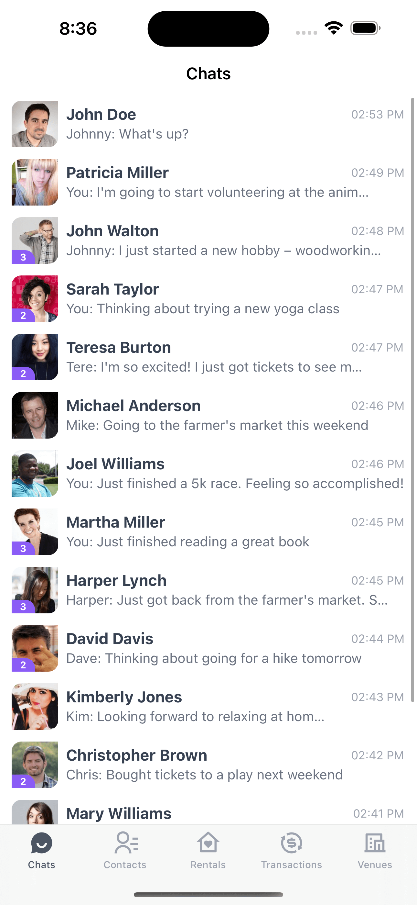
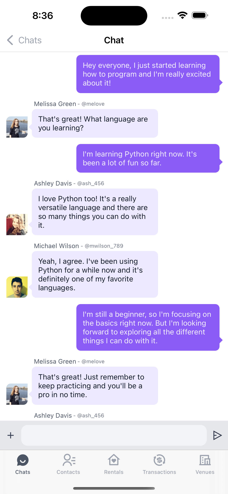

# Data Binding Demo App

This [**Titanium App**](https://titaniumsdk.com) is a cross-platform mobile application for iOS and Android that was created using [**PurgeTSS**](https://purgetss.com).

## Installation
First, make sure you have **PurgeTSS** installed globally on your machine:
```bash
> npm i -g purgetss
```
Then, download the App and run it on your device, or simulator.

## Content
The first release of this demo includes a Chats Demo with two views: one that shows a list of recent chats and another that provides a detailed view of a selected chat.

This app will contain the following demos:
- Chats ✅
- Contacts
- Rentals
- Transactions
- Venues

### Data Collections
This app is using Backbone Collections to simulate Dynamic content, but can easily be udpated to use:
- [RESTe](https://github.com/jasonkneen/RESTe)
- [Staballoy](https://github.com/Topener/staballoy)

Or any other method to create Collections!

#### Chats Tab



